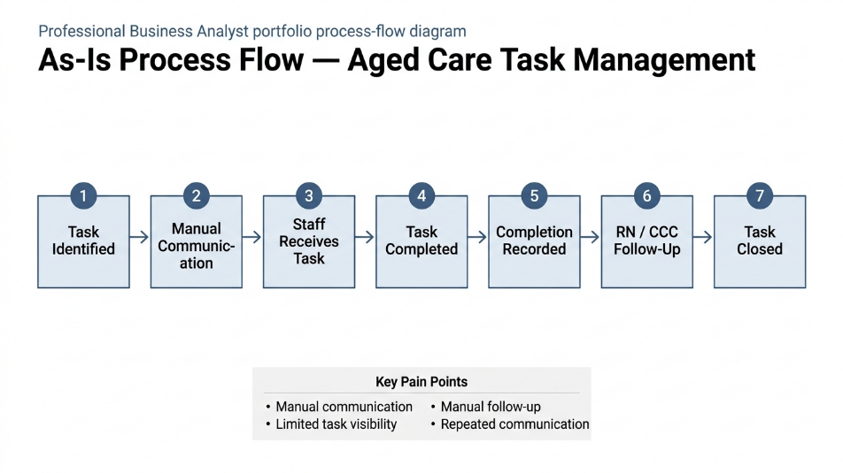
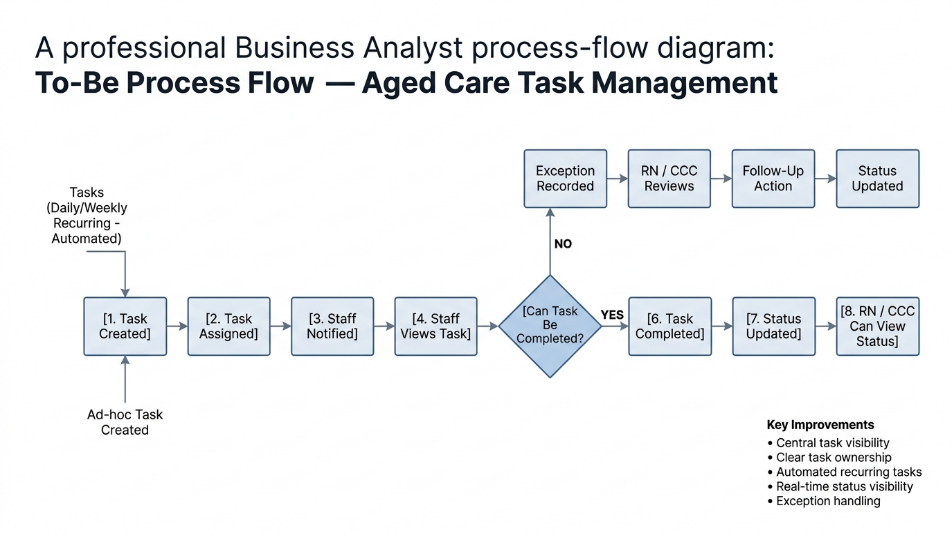

# Aged Care Daily & Weekly Task Management

## Business Analyst Portfolio Project

**Project Type:** Business Process Improvement
**Industry:** Aged Care
**Role:** Business Analyst
**Project Status:** Portfolio Case Study

---

## Project Overview

This project looks at how daily and weekly operational tasks can be communicated, assigned and monitored more consistently in an aged care environment.

The current process relies heavily on manual communication and follow-up. This can make it difficult for staff and clinical leaders to maintain a clear view of outstanding tasks, task ownership and completion status.

I analysed the current process and designed a proposed future-state workflow focused on improving task visibility, ownership and follow-up.

> **Note:** This is a fictionalised portfolio case study based on a realistic aged care operational scenario. No real resident, employee or confidential organisational information is included.

---

## Business Problem

The current process can involve:

* Manual communication of tasks
* Limited visibility of outstanding work
* Repeated communication for recurring tasks
* Manual follow-up by RNs and CCCs
* No consistent exception process when tasks cannot be completed

### Business Impact

These issues can create additional coordination work and make it harder to maintain a consistent view of operational tasks.

---

## Stakeholders

The main stakeholders considered in the analysis are:

* **Care Staff** — complete assigned tasks
* **Registered Nurses (RNs)** — monitor relevant tasks and follow up
* **Clinical Care Coordinators (CCCs)** — coordinate and monitor operational tasks
* **Care Management** — provides operational oversight
* **IT / Application Support** — supports the technology solution

---

# As-Is Process

The current-state analysis identified a process that relies heavily on manual communication and follow-up.

### Key Pain Points

* Manual communication
* Limited task visibility
* Manual follow-up
* Repeated communication

---

# Analysis

I analysed the current process to understand the underlying causes rather than simply proposing a technology solution.

The analysis identified a common root cause:

> **There is no consistent central process for managing operational task ownership and status.**

The analysis also considered the impact of task visibility, recurring work, overdue tasks and exceptions.

---

# To-Be Process

The proposed future-state process introduces clearer task ownership, central task visibility, status tracking and structured exception handling.

### Key Improvements

* Central task visibility
* Clear task ownership
* Recurring task management
* Status visibility
* Structured exception handling
* Reduced manual follow-up

---

# Business Requirements

The key requirements identified include:

1. Provide staff with a central view of assigned tasks.
2. Assign tasks to an appropriate staff member or team.
3. Provide consistent task statuses.
4. Support recurring daily and weekly tasks.
5. Allow authorised RNs and CCCs to monitor relevant tasks.
6. Allow staff to record task completion.
7. Provide a structured exception process.
8. Identify overdue tasks.
9. Maintain relevant task history.

Detailed requirements are documented in:

**[Requirements Document](requirements.md)**

---

# User Stories

The requirements were translated into user stories for the main user groups.

Examples include:

> **As a care staff member, I want to see my assigned tasks in one place so that I know what needs to be completed during my shift.**

> **As an RN, I want to see outstanding tasks so that I can identify tasks that may need follow-up.**

> **As a CCC, I want recurring tasks to be generated automatically so that staff do not have to receive the same instructions manually each time.**

See the complete:

**[User Stories & Acceptance Criteria](user-stories.md)**

---

# Requirements Traceability

A Requirements Traceability Matrix was created to connect:

**Business Requirement → User Story → Acceptance Criteria → UAT**

This helps ensure that requirements can be followed through to testing.

**[View Requirements Traceability Matrix](requirements-traceability-matrix.md)**

---

# UAT

The proposed solution includes business-focused UAT scenarios covering:

* Viewing assigned tasks
* Task assignment
* Task completion
* Recurring tasks
* Outstanding task monitoring
* Overdue tasks
* Exception recording
* Exception review
* Task history

**[View UAT Test Plan](uat-test-plan.md)**

---

# Stakeholder Analysis

The project includes stakeholder identification, stakeholder needs, Power/Interest analysis and a RACI matrix.

**[View Stakeholder Analysis & RACI](stakeholder-analysis.md)**

---

# Problem & Root Cause Analysis

The analysis used:

* Problem analysis
* Business impact analysis
* Root cause analysis
* Five Whys
* Improvement opportunity analysis

**[View Problem Analysis](problem-analysis.md)**

---

# BA Deliverables

| Deliverable          | Purpose                                           |
| -------------------- | ------------------------------------------------- |
| As-Is Process        | Understand current workflow                       |
| To-Be Process        | Design improved future state                      |
| Problem Analysis     | Identify root causes and impacts                  |
| Requirements         | Define business and system needs                  |
| User Stories         | Translate requirements into user needs            |
| RTM                  | Maintain requirement traceability                 |
| UAT Plan             | Validate proposed requirements                    |
| Stakeholder Analysis | Understand stakeholder needs and responsibilities |

---

# Key BA Skills Demonstrated

This project demonstrates practical experience with:

* Business problem analysis
* Process mapping
* As-Is / To-Be analysis
* Requirements elicitation
* Functional requirements
* Non-functional requirements
* Business rules
* User stories
* Acceptance criteria
* Requirements traceability
* UAT planning
* Stakeholder analysis
* RACI
* Root cause analysis
* Five Whys
* Process improvement
* Exception handling

---

# Expected Business Benefits

If implemented successfully, the proposed process could help improve:

**Visibility**
Staff and clinical leaders have a clearer view of task status.

**Communication**
Less reliance on repeated manual communication.

**Accountability**
Task ownership becomes clearer.

**Follow-Up**
Outstanding, overdue and exception tasks are easier to identify.

**Consistency**
Recurring tasks can follow a standard process.

---

# Project Reflection

This project helped me understand that Business Analysis is not simply about documenting requirements.

The important part is understanding the problem first, identifying the people affected by it, analysing the current process and then designing a future state that addresses the underlying issues.

The proposed solution is intentionally technology-neutral at this stage. In a real project, I would validate the requirements with stakeholders and assess potential technology options before recommending a specific solution.

---

## Project Files

* [Requirements](requirements.md)
* [User Stories & Acceptance Criteria](user-stories.md)
* [Requirements Traceability Matrix](requirements-traceability-matrix.md)
* [UAT Test Plan](uat-test-plan.md)
* [Problem & Root Cause Analysis](problem-analysis.md)
* [Stakeholder Analysis & RACI](stakeholder-analysis.md)
* [As-Is Process Diagram](as-is-process.png)
* [To-Be Process Diagram](to-be-process.png)
